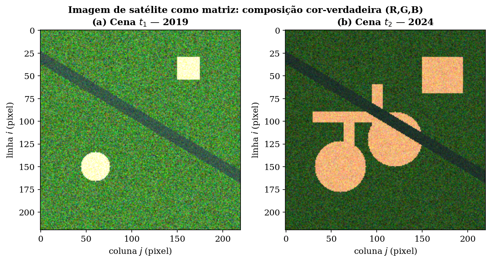
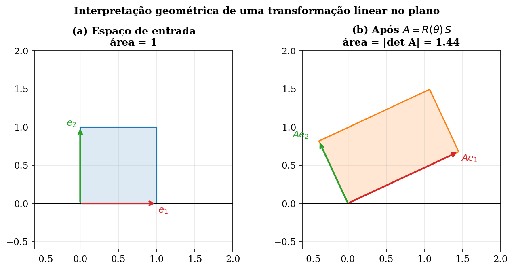
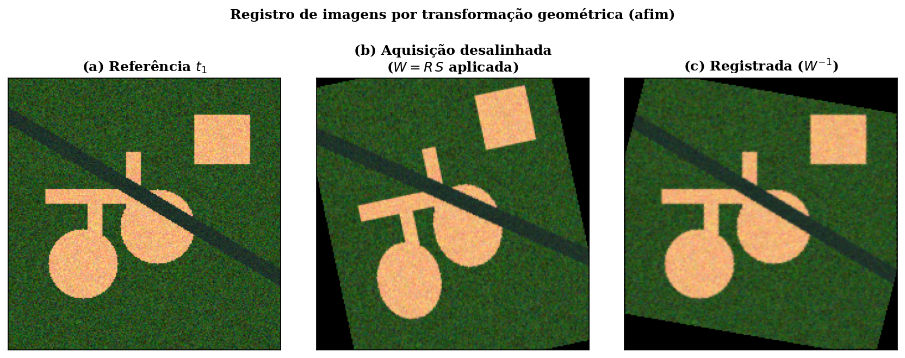
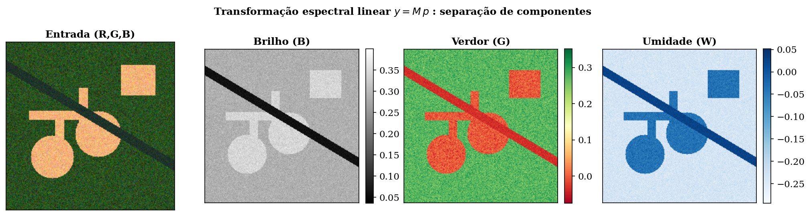
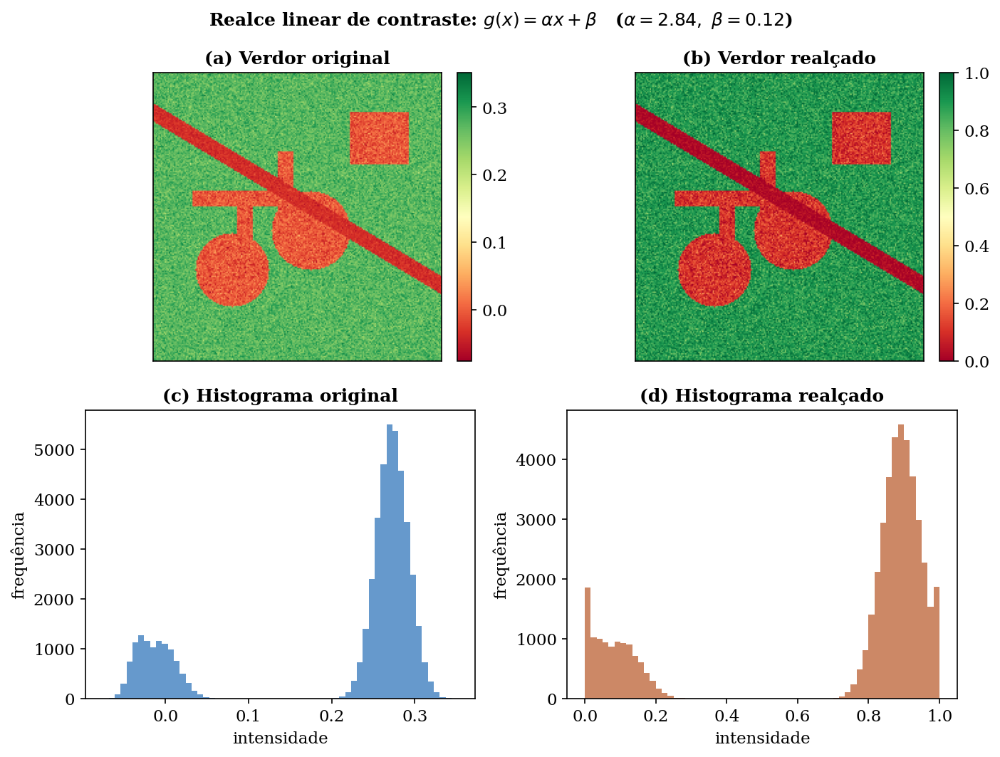
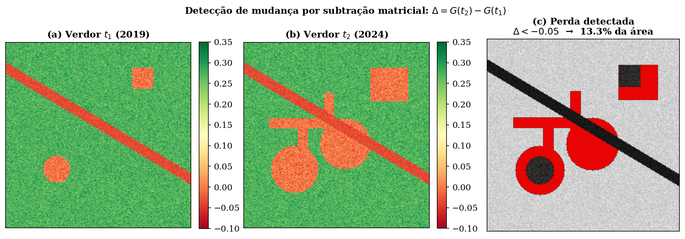

<div align="center">

# 🛰️ GS_MMC — Modelagem de Imagens de Satélite por Transformações Lineares

### Monitoramento de Desmatamento aplicando Álgebra Linear a dados de sensoriamento remoto

[](https://www.python.org/)
[](https://numpy.org/)
[](https://matplotlib.org/)
[](https://scipy.org/)
[](https://www.latex-project.org/)

[](https://www.fiap.com.br/)


</div>

---

## 📡 Sobre o projeto

> **Tema do semestre:** Indústria Espacial 🚀

Satélites de observação da Terra geram, continuamente, enormes volumes de dados que apoiam decisões em **sustentabilidade**, **agronegócio** e **meio ambiente**. Computacionalmente, **toda imagem de satélite é uma matriz**: cada posição `(i, j)` é um pixel e cada pixel carrega valores de reflectância em várias faixas do espectro.

Este trabalho explora essa ponte entre teoria e aplicação: **modela imagens multiespectrais como matrizes e usa transformações lineares da Álgebra Linear para monitorar o avanço do desmatamento** em uma área florestal, comparando duas datas (2019 e 2024).

<div align="center">

| 🎯 Métrica | 📊 Resultado |
|:---|:---:|
| Perda de cobertura vegetal detectada | **13,3 %** da área |
| Área desmatada estimada (10 m/pixel) | **≈ 64,5 ha** |
| Setores classificados como floresta | **22 → 18** (2019 → 2024) |

</div>

---

## 🧮 Modelagem matemática

O método encadeia **quatro transformações lineares**, todas expressas como operações matriciais:

### 1. Transformação espectral — `y = M · p`
Combina linearmente as 4 bandas de entrada `p = [B, G, R, NIR]ᵀ` para separar componentes físicas da cena (Brilho, Verdor, Umidade), inspirada na transformação *Tasseled Cap*:

```
⎡ Brilho  ⎤   ⎡  0.33   0.34   0.33   0.49 ⎤ ⎡  B  ⎤
⎢ Verdor  ⎥ = ⎢ -0.27  -0.22  -0.55   0.72 ⎥ ⎢  G  ⎥
⎣ Umidade ⎦   ⎣  0.19   0.31   0.24  -0.61 ⎦ ⎢  R  ⎥
                                            ⎣ NIR ⎦
```

### 2. Transformação geométrica afim — `W = R(θ) · S`
Alinha (registra) imagens de datas distintas. A inversa `W⁻¹` desfaz o desalinhamento — possível porque `det W ≠ 0`.

### 3. Realce linear de contraste — `g(x) = α·x + β`
Expande o intervalo dinâmico do canal de interesse (`α = 2,84`, `β = 0,12`).

### 4. Detecção de mudança — `Δ = G(t₂) − G(t₁)`
Subtração matricial: áreas estáveis se anulam (`Δ ≈ 0`) e apenas o desmatamento **novo** é destacado.

---

## 🖼️ Resultados visuais

<div align="center">

| | |
|:---:|:---:|
| **Cena como matriz (RGB)** | **Transformação linear no plano** |
|  |  |
| **Registro geométrico (afim)** | **Transformação espectral** |
|  |  |
| **Realce de contraste** | **Detecção de mudança** |
|  |  |

</div>

---

## 📂 Estrutura do repositório

```
GS_MMC_300526/
├── README.md
├── codigo/
│   ├── gerar_dados.py        # gera a base sintética (rasters + CSV)
│   └── gerar_graficos.py     # gera as 6 figuras do relatório
├── dados/
│   ├── cena.npz              # rasters multiespectrais t1 e t2
│   ├── dados_satelite.csv    # tabela agregada (25 setores × 2 datas)
│   └── metricas.txt          # métricas calculadas (det, α, β, % perda)
├── imagens/
│   └── fig01..fig06.png      # figuras geradas
└── relatorio/
    ├── relatorio.tex         # fonte LaTeX (padrão ABNT)
    └── relatorio.pdf         # documento final (11 páginas)
```

---

## ⚙️ Como reproduzir

**Pré-requisitos:** Python 3 (`numpy`, `matplotlib`, `scipy`) e uma distribuição LaTeX (`pdflatex`, com `babel` e `xurl`).

```bash
# clonar
git clone https://github.com/lincoln743/GS_MMC_300526.git
cd GS_MMC_300526

# instalar dependências Python
pip install numpy matplotlib scipy

# 1) gerar a base de dados
cd codigo
python3 gerar_dados.py

# 2) gerar as figuras
python3 gerar_graficos.py

# 3) compilar o relatório (duas passadas para o sumário)
cd ../relatorio
pdflatex -interaction=nonstopmode relatorio.tex
pdflatex -interaction=nonstopmode relatorio.tex
```

> 💡 O `relatorio.tex` usa o babel moderno via `\babelprovide[main,import]{portuguese}` e o pacote `xurl` — ambos já incluídos no TeX Live atual.

---

## 🛠️ Tecnologias

- **Python** — NumPy (álgebra matricial), Matplotlib (visualização), SciPy (transformação afim de imagens)
- **LaTeX** — relatório acadêmico no padrão **ABNT**

---

## 👥 Autores

<div align="center">

| Nome | RM |
|:---|:---:|
| **Lincoln Simão Pereira** | 567284 |
| **Miguel Silva Bezerra** | 566763 |
| **Nicolas Sakaue Nishimura** | 567752 |

</div>

**Disciplina:** Modelagem Matemática e Computacional
**Professor:** Igor Gimenes Cesca
**Instituição:** FIAP — Faculdade de Informática e Administração Paulista

---

<div align="center">

📫 **Contato:** [lincoln743@gmail.com](mailto:lincoln743@gmail.com) · [github.com/lincoln743](https://github.com/lincoln743)

<sub>Projeto acadêmico desenvolvido para a Global Solution — Tema: Indústria Espacial 🛰️</sub>

</div>
